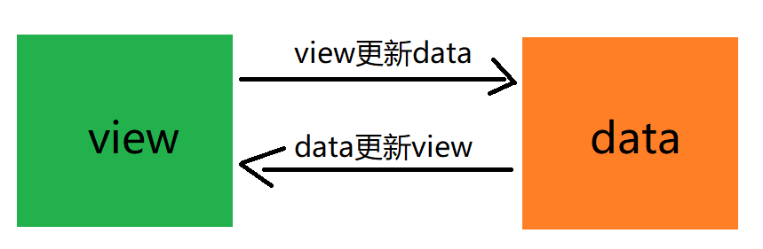
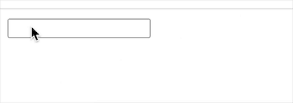

## 响应式原理

vue 官网这样定义 vuejs：渐进式的javascript框架：
如何理解渐进式：如果你有一个现成的服务端应用，你可以将 vue 作为应用的一部分嵌入到应用中以带来更加丰富的业务体验，如果你想要更多的交互逻辑放在前端实现，vue的核心库以及生态也可以满足需求

### 1. 什么是响应式
响应式有两个核心要素：**视图改变，更新数据；数据改变，变化视图**。这意味着我们在开发的时候只需要进行数据管理，不需要频繁操作dom元素。

**视图变化更新数据，其实比较容易实现**，事件监听即可实现，比如input标签监听 'input' 事件。但是**当数据改变的时候，如何更新视图呢**？这就需要知道何时数据发生变化，当知道数据发生变化，我们就可以对视图进行更新。

### 2. 实现：
vue2.0是用 Object.defineProperty() 方法中setter与getter的观察者模式。
vue3.0是基于 Proxy 代理对属性的拦截，实现双向绑定。

### 3. Object.defineProperty() 与双向绑定(vue2.x双向绑定实现)
Object.defineProperty() 会直接在一个对象上定义一个新属性，或者修改一个对象的现有属性，并返回此对象。
这个函数接受三个参数，一个参数是obj，表示要定义属性的对象,一个参数是 prop ，是要定义或者更改的属性名字，另外是 descriptor 描述符，来定义属性的具体描述。`Object.defineProperty(obj, prop, descriptor)`
#### 3.1 对象与属性
javascript中一共有三种属性：
**普通属性：** 即常规的数据属性，这种属性是用户来添加修改等，把它设置成什么样，就返回出来什么样，不会做些额外的事情。
我们通常使用点或者方括号对普通属性进行赋值和访问
```javascript
let obj = {};
obj.x = 1;
obj['y']= 12;
console.log(obj.x);  //  1
console.log(obj.y);  //  12
let proprrty = Object.keys(obj);
console.log(proprrty) // ["x", "y"]
delete obj.x;
console.log(obj.x);  //  undefined
```
**内部属性：** 比如数组arr的length属性，函数的prototype属性，DOM节点的innerHTML属性，用户赋完值以后，取值的时候，不一定按预期，有时候还会额外的做一些事情，也难以改变他们的行为。
比如说某一数组，它的长度为10, 当我们设置它为11时，它就会增加一个undefined元素，再设置为9时，就会从后面删掉两个元素。(后文数组监听可以观察到此变化)
函数的prototype如果被改变，相当于将其父类改变了，会new不同类型的实例。
DOM的innerHTML，我们赋值时是一个字符串，再取出时，这字符串可能会与原来的不一样， 并且在原元素上生成了不一样的子节点。

**访问器属性：** 即通过 Object.defineProperty() 定义的属性，用户在赋值或取值都经过预先设定的函数，从而实现内部属性的那一种特殊效果，。

对于普通属性，对象的属性可以修改可以删除也可以枚举，但是通过 Object.defineProperty() 定义属性，通过描述符的设置可以进行更精准的实现对控制对象属性的控制。
#### 3.2 descriptor属性描述符
属性描述符分为两种：**数据描述符与存取描述符。**
数据描述符是一个具有值的属性，该值可以是可写的，也可以是不可写的。(**value, writable, <font color=#D2691E>configurable, enumerable</font>**).
存取描述符是由 getter 函数和 setter 函数所描述的属性。(**get, set, <font color=#D2691E>configurable, enumerable</font>**).
布尔值的键configurable、enumerable 和 writable 的默认值都是 false。
属性值和函数的键 value、get 和 set 字段的默认值为 undefined。

```javascript
数据描述符

const obj = {};

// x属性 value不可修改  Writable Enumerable 不可修改
Object.defineProperty(obj, 'x', {
  value: 1,   
  // 可否修改  默认false
  writable: false,  
  // 可否被删除,以及除 value 和 writable 特性外的其他特性是否可以被修改
  configurable: false, 
  // 可否在for...in循环和Object.keys() 中被枚举
  enumerable: false, 
});

obj.x = 77; 
console.log(obj.x);    // 1
delete obj.x 
let property = Object.keys(obj);
console.log(property) //[]
Object.defineProperty(obj, 'x', {configurable: true}) // throw error

// y属性 value不可修改 Writable Enumerable 可修改
Object.defineProperty(obj, 'y', {
  value: 1,   
  writable: false,  
  configurable: true, 
  enumerable: false, 
});

obj.y = 12;
console.log(obj.y);    // 1
// configurable true  可修改 writable enumerable
Object.defineProperty(obj, 'y', {writable: true});
obj.y = 12;
console.log(obj.y);    // 12
property = Object.keys(obj);
console.log(property) //[]
Object.defineProperty(obj, 'y', {enumerable: true});
property = Object.keys(obj);
console.log(property) //["y"]
```
```javascript
存取描述符

const obj = {};
let val;
Object.defineProperty(obj, 'x', {
  get() { 
    console.log('触发get')
    return val; 
  },
  set(newValue) {
    console.log('触发set')
    val = newValue; 
  },
})
obj.x = 12; // 触发set
console.log(obj.x)  // 触发get  12 

```
#### 3.2 通过Object.defineProperty()实现简单双向绑定

```html
<div>
    <input type="text" id="value"/>
    <span id="bindValue"></span>
</div>
```
```javascript
// 视图交互控制
let inputEle = document.getElementById('value');
let spanEle = document.getElementById('bindValue');
const MessageObj = {};
Object.defineProperty(MessageObj, 'msg', {
  set: function (newVal) {
    inputEle.value = newVal;
    spanEle.innerText = newVal
  }
})
// 监听input输入  视图变化 更新数据
inputEle.addEventListener('keyup', function (event) {
  MessageObj.msg = event.target.value
})
// 数据变化 更新视图
setTimeout(()=>{
  MessageObj.msg = '数据变化更新视图'
},1000)
```
#### 3.3 观察者模式
vue.js 则是采用数据劫持结合观察者模式(发布者-订阅者模式)的方式，通过 Object.defineProperty() 来劫持各个属性的 setter，getter，在数据变动时发布消息给订阅者，触发相应的监听回调。
通过上文，我们已经对Object.defineProperty()有了一定了解，那么我们继续看什么是观察者模式。
**概念**

> **观察者模式（Observer）**通常又被称为 **发布-订阅者模式** 或 **消息机制**，它定义了对象间的一种一对多的依赖关系，只要当一个对象的状态发生改变时，所有依赖于它的对象都得到通知并被自动更新，解决了主体对象与观察者之间功能的耦合，即一个对象状态改变给其他对象通知的问题。

上文的定义比较官方，总而言之，订阅者模式分为注册和发布两个环节，我们可以用生活中的场景更加通俗的理解。
**故事性的通俗理解**
假设我们去银行办业务，因为办业务的人比较多，我们会被要求在取号机上去一个号码，这就是注册环节。银行职员与办理业务的人员就是一对多的依赖关系，银行职员对号牌任务一个一个进行处理，没处理完一个任务，都需要通知所有依赖对象(办业务人员)当前状态的改变，银行办公大厅的led显示牌会时刻显示当前正在办业务的号码以及下一位将要办理业务的号码，银行处理业务的职员就相当于发布者，led显示屏维护了一个观察者列表，时刻关注led显示屏的我们就是订阅者。当轮到我们的号牌办理业务时，我们就会被通知到指定柜台办理业务，这就是发布环节。
```javascript
简单的观察者模型
function observer () {
  this.dep = [];

  this.register = (fn) => {
    this.dep.push(fn);
  }

  this.notify = () => {
    this.dep.forEach(item => item())
  }
}

let bankObserver = new observer();
bankObserver.register( () => {console.log("取现金")} );
bankObserver.register( () => {console.log("办卡")} );

bankObserver.notify();
```
通过上面例子我们可以提炼出观察者模式的三个要素：发布者、订阅者、缓存列表。简而言之观察者模式就是一个对象(发布者)维护一个依赖他的对象（缓存列表）列表，当自身状态发生变化时，自动通知所有订阅者。当某个对象不需要获得通知时，可以从对象列表中删除掉。
**javascript中的观察模式**
JavaScript是一个事件驱动型语言，观察模式的实现主要依靠事件模型，例如常用的一些onclick、 attachEvent 、addEventListener 都是观察者模式的具体应用。
```javascript
// html
<span id="span-click">点击</span>
// javascript
let spanEle = document.getElementById('span-click');
spanEle.addEventListener('click',function(){
    alert('我是一个观察者，你一点击，我就知道了');
});
```
#### 3.4 观察者模式与Object.defineProperty()结合的双向绑定实现
##### 双向绑定过程：
1. 组件初始化时，遍历 data 的每个属性，并使用 Object.defineProperty() 给每个属性都注册 setter 和 getter ，也就是 reactice 化。
2. 每个组件实例都对应一个 watcher 实例，它会在组件渲染的过程中把“接触”过的数据属性记录为**依赖**。之后当依赖项的 setter 触发时，会通知 watcher，从而使它关联的组件重新渲染。

##### 什么是依赖？
依赖就是一个个的大括号表达式和指令表达式
```javascript
// v-model="value" 是一种依赖 v-指令(非事件) 都是依赖
<input type="text" id="value" v-model="value"/> 
// {{bindValue}} 也是依赖 大括号表达式都是一个依赖
<span>{{bindValue}}</span>  
```
很显然，每一个依赖都对应着data中的数据，因此依赖可以简单理解为视图层对数据层的关系：**视图层显示依赖于数据层的数据**-依赖关系。**依赖收集的目的就是为了应对将来数据的变化，从而当依赖的数据发生变化时能够准确的批量的更新依赖所在地的显示**。

###### 实现数据监听器
代码实现如下：
```javascript

// 定义观察者 一个数据监听器 如果要对所有属性都进行监听的话，那么可以通过递归方法遍历所有属性值，并对其进行Object.defineProperty () 处理
  function observe(data){
    if (!data || typeof data !== 'object') {
      return;
    }
    Object.keys(data).forEach((key)=>{
      defineReactive(data, key, data[key])
    })
  }
  function defineReactive (obj, key, value){
      let dep = new Dep();
      observe(value);
      Object.defineProperty(obj, key, {
        enumerable: true,
        configurable: true,
        set: (newValue) => {
            console.log('值被设置')
          if( newValue !== value ){
              value = newValue;
              console.log(dep,'dep')
              //更新视图
              dep.notify();
            }
        },
        get: () => {
            console.log('值被获取',Dep)
          if(Dep.target) {
              dep.addSub(Dep.target);
          }
          return value;
        },
      })
  }
  // 依赖收集 订阅者列表
  // 主要负责收集订阅者，然后再属性变化的时候执行对应订阅者的更新函数
  function Dep () {
      this.subs = [];
  }
  Dep.prototype = {
      addSub: function(sub) {
          this.subs.push(sub);
      },
      notify: function() {
          console.log(this.subs,'this.subs')
          this.subs.forEach(function(sub) {
              sub.update();
          });
      }
  };
  // 订阅者
  function Watcher(data, key,cb) {
      this.cb = cb;
      this.data = data;
      this.key = key;
      // 此处为了触发属性的getter，从而在dep添加自己，结合Observer更易理解
      this.value = this.get(); 
  }
  Watcher.prototype = {
      update: function() {
          this.run(); // 属性值变化收到通知
      },
      run: function() {
          var value = this.get(); // 取到最新值
          console.log(value,'取到最新值')
          var oldVal = this.value;
          if (value !== oldVal) {
              this.value = value;
              this.cb(); // 执行Compile中绑定的回调，更新视图
          }
      },
      get: function() {
          Dep.target = this;  // 将当前订阅者指向自己
          var value = this.data[this.key];   // 触发getter，添加自己到属性订阅器中
          Dep.target = null;  // 添加完毕，重置
          return value;
      }
  };
  function SelfVue (data, key, cb) {
      this.data = data;
      observe(data);
      cb(); // 初始化模板数据的值
      new Watcher(this.data, key,cb);
      return this;
  }
```
```html
<script src="./vue/vue.js"></script>
<div id="box">
  <span id="app"></span> 
  <span id="add" style="margin-left: 10px;display: inline-block;width: 10px;height: 10px;cursor: pointer;">+</span>
</div>
<script>
    let ele = document.getElementById('app');
    let btn = document.getElementById('add');
    let o = {
            number: 1,
    }
    var selfVue = new SelfVue(o , 'number',
      ()=>{ ele.innerHTML = o.number}
    );
    btn.addEventListener('click', () => {
      o.number += 1;
    },false)
</script>
```


### 4. Proxy 与双向绑定(vue3.0双向绑定实现)
defineProperty()与观察者模式是vue2.0实现双向绑定的方式，而vue3.0使用es6的新语法中的代理内建工具Proxy和发射工具reflect来实现，接下来我们看下如何用Proxy实现同样的功能。
#### 4.1 认识Proxy
**proxy的概念**

**Proxy 对象用于定义基本操作的自定义行为（如属性查找、赋值、枚举、函数调用等）。**
proxy英文原意是代理的意思，在ES6中，可以翻译为"代理器"。
它主要用于改变某些操作的默认行为，proxy在目标对象的外层搭建了一层拦截，外界对目标对象的某些操作，必须通过这层拦截。
此方法接受**两个参数**：**target** — 要使用 Proxy 包装(处理)的目标对象（可以是任何类型的对象，包括原生数组，函数，甚至另一个代理）。**handler** — 通常以函数作为属性的对象，各属性中的函数分别定义了在执行各种操作时代理 p 的行为。

**基本用法**

数据拦截：支持13 种的拦截,相对Object.defineProperty更加丰富。
示例代码如下：
（1） Object数据拦截
```javascript
let target = {};
let handler = {
  // 拦截对象属性的读取，比如proxy.a和proxy['a']
  get (target, key) {
    console.info(`Get on property "${key}"`);
    return target[key];
  },
  // 拦截对象属性的设置，比如proxy.a = 1 和proxy['a'] = 1
  set (target, key, value) {
    console.info(`Set on property "${key}" new value "${value}"`);
    target[key] = value;
  },
  // 拦截propKey in proxy 返回布尔值
  has (target, key) {
    console.log(`is "${key}" in object ?`);
    // 隐藏 某些属性
    if( key === 'a'){
      return false;
    }else{
      return key in target;
    }
    // return key in target;
  },
  // delete 操作符的捕捉器 删除前拦截 进行处理 返回布尔值
  deleteProperty(target, key){
    console.log(`delete key: "${key}"`);
    if(key === 'a'){
        delete target[key];
    }else{
        return target[key];
    }
  },
  // 拦截对象自身属性的读取操作，具体拦截以下操作：Object.getOwnPropertyNames 方法和 Object.getOwnPropertySymbols object.keys() 
  ownKeys (target) {
    console.log(`key in target`)
    // (1)  正常返回
    // return Reflect.ownKeys(target);
    // （2）error 'ownKeys' on proxy: trap result did not include 'd'
    //  enumerable 的属性必须在数组中返回
    // return ['b'] 
    // (3) 
    return ['b','d']
  },

  // 拦截Object.setPrototypeOf方法
  setPrototypeOf (target, newProto) {
    console.log(`new prototype set object`);
    return true
  }
  // 当读取代理对象的原型时，该方法就会被调用。  返回值必须是一个对象或者null 
  // Object.getPrototypeOf  .instanceof  
  // .__proto__  object.prototype.isPrototypeOf()   
  // object.prototype.__proto__
  getPrototypeOf (target) {
    console.log(`prototype in object`);
    // return Object.getPrototypeOf(target);
    return null;
  },

  // 拦截Object.preventExtensions(),且必须在内部调用此方法
  preventExtensions(target) {
    console.log("called_pre");
    Object.preventExtensions(target);
    return true;
  },
  // 拦截Object.isExtensible 默认情况下，对象是可扩展的：即可以为他们添加新的属性。
  //以及它们的 __proto__ 属性可以被更改。
  //Object.preventExtensions，Object.seal 或 Object.freeze 方法都可以标记一个对象为不可扩展（non-extensible）
  // 它的返回值必须与目标对象的isExtensible属性保持一致
  // Object.isExtensible(proxy) === Object.isExtensible(target)
  isExtensible: function(target) {
    console.log("called");
    return Object.isExtensible(target);;
  },

  // 拦截Object.getOwnPropertyDescriptor()，返回一个属性描述对象或者undefined。
  getOwnPropertyDescriptor(target, key){
    if (key === 'b') {
      // return; // error 'b' which exists in the non-extensible proxy target
      return Object.getOwnPropertyDescriptor(target, key);
    }
    return Object.getOwnPropertyDescriptor(target, key);  
  },


  // 拦截 Object.defineProperty() 返回布尔值 表示操作成功与否
  defineProperty(target, key, descriptor){
    console.log(`Object.defineProperty property ${key}`);
    Object.defineProperty(target, key, descriptor)
    return true;
  }
}
let proxy = new Proxy(target, handler);

proxy.a = 1;         //  Set on property "a" new value "1"
proxy.b = 2;         //  Set on property "b" new value "2"

console.log(proxy.a);//  Get on property "a"      //  1

console.log("a" in proxy );// is "a" in object ?  // false
console.log("b" in proxy );// is "b" in object ?  // true

delete proxy.a; // delete key: "a"
console.log(proxy.a);// Get on property "a" // undefined
delete proxy.b; // delete key: "b"
console.log(proxy.b);// Get on property "b" // 2

proxy.c = 3;
Object.defineProperty(proxy,'d',{
    value:'4',
    enumerable: false,
})
// (1) 过滤掉三类属性 
//目标对象上不存在的属性  属性名为 Symbol 值  不可遍历（enumerable）的属性
// console.log(Object.keys(proxy)); // ['b', 'c']
//（3） 返回拦截 只返回b
console.log(Object.keys(proxy)); // ['b']


let newProxy = {};
Object.setPrototypeOf(proxy,newProxy);// new prototype set object
console.log(Object.getPrototypeOf(proxy));// prototype get object // {}

let flag = Object.isExtensible(proxy);// called
console.log(flag); // true
flag = Object.preventExtensions(proxy)// called_pre
console.log(flag); // Proxy {b: 2, c: 3, d: "4"}
flag = Object.isExtensible(proxy);// called
console.log(flag);//false

console.log("------------");

console.log(proxy) // Proxy {b: 2, c: 3, d: "4"}
flag = Object.getOwnPropertyDescriptor(proxy, 'a');
console.log(flag) // undefined
flag = Object.getOwnPropertyDescriptor(proxy, 'c');
console.log(flag) // {value: 3, writable: true, enumerable: true, configurable: true}
flag = Object.getOwnPropertyDescriptor(proxy, 'b'); // 不可扩展必须返回
console.log(flag) // {value: 2, writable: true, enumerable: true, configurable: true}

console.log("+++++++++++++++");
// Object.defineProperty(proxy, 'name', {
//     value: 'proxy',
// });  // error the non-extensible proxy target 对象不可扩展了 前面代码执行的结果
Object.defineProperty(proxy, 'c', {
    value: 'proxy',
});
console.log(proxy) // Proxy {b: 2, c: "proxy", d: "4"}

```
（2）函数调用拦截  apply   construct
```javascript
let handler1 = {
  //拦截函数调用、call、apply操作 三个参数分别是：
  //1.目标对象 2.目标对象的上下文对象（this） 3.目标对象的参数数组
  apply (target, thisArg, argumentsList) {
    console.log(`Calculate sum: ${argumentsList}`);
    return 'Proxy ok'
  },
  // 用于拦截new命令 返回的必须是一个对象
  construct (target, args, newTarget) {
    console.log(`args is ${args}`)
    return new target('修改的小明');
  }
}

function sum (a,b){
  return a+b;
}
let proxy1 = new Proxy(sum, handler1)
console.log(sum(1,2)); // 3
console.log(proxy1(1,2));// Calculate sum: 1,2 // Proxy ok

function person (name) {
  this.name = name;
}
let proxy2 = new Proxy(person, handler1)
let person1 = new person();
console.log(person1);  // person {name: "小明"}
let person2 = new proxy2();
console.log(person2); // person {name: "修改的小明"}
```
#### 4.2 Proxy与双向绑定实现
示例效果：

示例代码：
```html
<div>
    <input type="text" id="value"/>
    <span id="bindValue"></span>
</div>
```
```javascript
let inputEle = document.getElementById('value');
let spanEle = document.getElementById('bindValue');
const MessageObj = {};
let basehandler = {
    set(target, key, newVal){
        target[key] = newVal
        spanEle.innerText = newVal
    }
}
let proxy = new Proxy(MessageObj, basehandler)
// 监听input输入
inputEle.addEventListener('keyup', function (event) {
    proxy.msg = event.target.value
})
```

#### 4.3 认识Reflect
**Reflect对象与Proxy对象一样，也是 ES6 为了操作对象而提供的新 API。**
Proxy代理通过拦截修改某些方法，而Reflect是将一些方法移植到该对象上，使某些方法变为更加合理。现阶段，某些方法同时在Object和Reflect对象上部署，未来的新方法将只部署在Reflect对象上。也就是说，从Reflect对象上可以拿到语言内部的方法。
示例代码如下：
```javascript
// ES5写法
try{
  Object.defineProperty(target,property,attributes);
   //success
} catch(e){
  //failure
}

//ES6写法
if(Reflect.defineProperty(target,property,attributes)){
  //success
} else{
  //failure
}

// ES5写法
Function.prototype.apply.call(Math.floor,undefined,[1.75]) //1

//ES6写法
Reflect.apply(Math.floor,undefined,[1.75]) //1
```
Reflect对象一共有 13 个静态方法，大部分与Object对象的同名方法的作用都是相同的，而且它与Proxy对象的方法是一一对应的,可以说只要是Proxy对象的方法，就能在Reflect对象上找到对应的方法。这就让Proxy对象可以方便地调用对应的Reflect方法，完成默认行为，作为修改行为的基础。也就是说，不管Proxy怎么修改默认行为，你总可以在Reflect上获取默认行为。
**也就是说，Reflect.fn表示handler中的fn的默认行为。**
示例用法：
```javascript
var obj = new Proxy({}, {
  get: function (target, key, receiver) {
    console.log(`getting ${key}!`);
    // 在浏览器console中，get方法会默认打印出值
    // 如果没有Reflect.get执行默认行为，就无法正确打印出值，而会打印undefined
    return Reflect.get(target, key, receiver);
  },
  set: function (target, key, value, receiver) {
    console.log(`setting ${key}!`);
    return Reflect.set(target, key, value, receiver);
  }
});
obj.a = 12;
console.log(obj.a)
```
#### 4.4 vue3.0双向绑定实现
##### 4.4.1 实现数据劫持 reactive
首先用proxy代理完成数据劫持，代码如下：
```javascript
// 将响应式与原始数据保存  防止重复代理 如下图所示
// let obj = {
//     a:1
// }
// let p = new Proxy(obj, basehandler)  // 同样数据 重复代理
// let p1 = new Proxy(obj, basehandler) // 同样数据 重复代理
// let p2 = new Proxy(obj, basehandler) // 同样数据 重复代理
// 原始=>响应式   存放代理后的对象
let toProxy = new WeakMap();
// 响应式=>原始  存放代理前的对象
let toRaw = new WeakMap();
// 收集依赖  动态创建依赖关系
function track(target, key){
  // 收集依赖
}
// 更新视图
function trigger(target, key, info){
  // 更新视图
}
// **** 观察者 代理 与vue2 不同 ****
const baseHandler = {
    get (target, key) {
        console.log('收集依赖，数据初始化')
        const res = target[key];
        // 收集依赖  将effect key 对应起来  订阅
        // @todo 
         track(target, key);
        // 判断是否为对象 为对象的话继续代理
        return typeof res === "object" ? reactive(res) : res;  
    },
    set (target, key, newVal) {
        console.log('数据变化')
        const info = {oldValue:target[key], newValue:newVal};
        // target[key] = newVal;  如果设置没成功 这对象不可以被设置 会报错 Reflect设置反射 有返回值
        const res = Reflect.set(target, key, newVal );
        // 触发私有属性才更新 如 arr length变化 不触发更新
        if(target.hasOwnProperty(key)){
            // 通知更新
            // @todo 
          trigger(target, key, info);
        }
        return res;
    }
}
function reactive (target) {
    console.log(target,'响应式数据')
    // 如果不是对象 则返回
    if(typeof target !== 'object' && target === null){
        return target;
    }
    // 如果代理的数据中存在 则不再进行代理
    let proxy = toProxy.get(target)
    if(proxy){
        return proxy;   
    }
    // 如果对象已经代理过了 则返回该对象
    if(toRaw.has(target)){
        return target;   
    }
    // 创建观察者
    const observed = new Proxy(target, baseHandler);
    toProxy.set(target, observed);  // 原对象为键 代理后对象为值
    toRaw.set(observed, target);  // 原对象为键 代理后对象为值
    console.log(observed,'响应完成')
    return observed;
}
```
##### 4.4.2 创建响应式依赖
在上文中，我们知道，所有响应式的数据，在vue2.0中都叫做依赖，vue3.0中叫做effect，即副作用，可以浅显理解为，数据改变的副作用---->更新视图。要想数据变化，依赖能够自动执行视图更新的方法，就需要创建响应式依赖。代码如下：
```javascript
// let obj = {name:'aa'}
// effect(()=>{
//     console.log(obj.name)  // 此处触发get  然后收集依赖  将key effect 对应起来
// })
// obj.name = 'bb'
// effect 数据变化 更新视图的方法  默认执行一次进行数据初始化 数据变化 再执行
// 创建响应式依赖，并放在依赖的数组中
let effectStack = []  // {name:effect()}  // 收集依赖对应关系
// {
//     target:{
//         key:[fn,fn,fn]
//     }
// }
function effect (fn) {
    // 数据变化 函数执行 变成响应式函数
    let effect = createReactiveEffect(fn);
    effect(); // 默认先执行一次
    return effect;
}
function createReactiveEffect(fn){
    let effect = function(){  // 响应式的effect
        return run(effect,fn);  // fn执行 且 存在栈中
    };
    return effect;
}
function run (effect, fn) {
    try{
        effectStack.push(effect);
        return fn();
    }finally{
        effectStack.pop();
    }
}
```
##### 4.4.3 依赖收集以及数据更新
接下来我们实现依赖收集以及数据更新页面变化，即执行effect。代码如下：
```javascript
let targetMap = new WeakMap();  // 收集依赖
// 收集依赖  动态创建依赖关系
function track (target, key) {  
    let effect = effectStack[effectStack.length-1];
    if(effect){  // 有对应关系 才创建关联
        let depMap = targetMap.get(target);
        if(depMap === undefined){
            depMap = new Map();
            targetMap.set(target, depMap);
        }
        let dep = depMap.get(key);
        if(dep === undefined) {
            dep = new Set();
            depMap.set(key, dep);
        }
        if(!dep.has(effect)){
            dep.add(effect)
        }
    }
}
// 更新视图
function trigger (target, key, info) {
    
    const depMap = targetMap.get(target);
    
    if(!depMap){
        return;
    }
    const effects = new Set();
    if(key){
        let deps = depMap.get(key);
       
        if(deps){
            deps.forEach(effect=>{
                effects.add(effect)
            })
        }
    }
    effects.forEach(effect => effect())
}
```
##### 4.4.4 完整代码及demo效果
```html
<div id="box" style="margin-left: 20px;">
    <span id="app"></span> 
    <span id="add" style="margin-left: 10px;display: inline-block;width: 10px;height: 10px;cursor: pointer;">+</span>
</div>
<script src="./vue/vue3.js"></script>
<script>
    let ele = document.getElementById('app');
    let btn = document.getElementById('add');
    let o = {
        number: 1,
    }
    let reactiveData = reactive(o);
    effect(()=>{
        console.log('数据变了')
        ele.innerHTML = reactiveData.number
    })
    btn.addEventListener('click', () => {
        reactiveData.number += 1;
    },false)
</script>
```
```javascript
// vue3.js
// 将响应式与原始数据保存  防止重复代理 如下图所示
// let obj = {
//     a:1
// }
// let p = new Proxy(obj, basehandler)
// let p1 = new Proxy(obj, basehandler)
// let p2 = new Proxy(obj, basehandler)
// 原始=>响应式   存放代理后的对象
let toProxy = new WeakMap();
// 响应式=>原始  存放代理前的对象
let toRaw = new WeakMap();

let targetMap = new WeakMap();  // 收集依赖
let effectStack = []  // {name:effect()}  // 收集依赖对应关系
// {
//     target:{
//         key:[fn,fn,fn]
//     }
// }
// 收集依赖  动态创建依赖关系
function track (target, key) {  
    let effect = effectStack[effectStack.length-1];
    if(effect){  // 有对应关系 才创建关联
        let depMap = targetMap.get(target);
        if(depMap === undefined){
            depMap = new Map();
            targetMap.set(target, depMap);
        }
        let dep = depMap.get(key);
        if(dep === undefined) {
            dep = new Set();
            depMap.set(key, dep);
        }
        if(!dep.has(effect)){
            dep.add(effect)
        }
    }
}
// 更新视图
function trigger (target, key, info) {
    
    const depMap = targetMap.get(target);
   
    if(!depMap){
        return;
    }
    const effects = new Set();
    if(key){
        let deps = depMap.get(key);
       
        if(deps){
            deps.forEach(effect=>{
                effects.add(effect)
            })
        }
    }
    effects.forEach(effect => effect())
}

// 观察者 代理 与vue2 不同
const baseHandler = {
    get (target, key) {
        const res = target[key];
        // 收集依赖  将effect key 对应起来  订阅
        track(target, key);
        return typeof res === "object" ? reactive(res) : res;  // 判断是否为对象 为对象的话继续代理
    },
    set (target, key, newVal) {
        const info = {oldValue:target[key], newValue:newVal};
        // target[key] = newVal;  如果设置没成功 这对象不可以被设置 会报错 Reflect设置反射 有返回值
        const res = Reflect.set(target, key, newVal );
        // 通知更新
        // 触发私有属性才更新 如 arr length变化 不触发更新
        if(target.hasOwnProperty(key)){
            trigger(target, key, info);
        }
        return res;
    }
}
function reactive (target) {
    // 如果不是对象 则返回
    if(typeof target !== 'object' && target === null){
        return target;
    }
    // 如果代理的数据中存在 则不再进行代理
    let proxy = toProxy.get(target)
    if(proxy){
        return proxy;   
    }
    // 如果对象已经代理过了 则返回该对象
    if(toRaw.has(target)){
        return target;   
    }
    // 创建观察者
    const observed = new Proxy(target, baseHandler);
    toProxy.set(target, observed);  // 原对象为键 代理后对象为值
    toRaw.set(observed, target);  // 原对象为键 代理后对象为值
    console.log(observed,'响应完成')
    return observed;
}

// let obj = {name:'aa'}
// effect(()=>{
//     console.log(obj.name)  // 此处触发get  然后收集依赖  将key effect 对应起来
// })
// obj.name = 'bb'
// effect 数据变化 更新视图的方法  默认执行一次 数据变化 再执行
function effect (fn) {
    // 数据变化 函数执行 变成响应式函数
    let effect = createReactiveEffect(fn);
    effect(); // 默认先执行一次
    return effect;
}
function createReactiveEffect(fn){
    let effect = function(){  // 响应式的effect
        return run(effect,fn);  // fn执行 且 存在栈中
    };
    return effect;
}
function run (effect, fn) {
    try{
        effectStack.push(effect);
        return fn();
    }finally{
        effectStack.pop();
    }
}
```

### 5.总结
vue3.0 摒弃了Object.defineProperty() 而采用了 proxy ,最后我们总结一下这两者的区别：
**(1) defineProperty() 只能监听某个属性，不能对全对象监听,proxy监听整个对象，并返回一个新对象，可以省去for in、闭包等内容来提升效率。**
```javascript
let obj1 = {
    a: 1,
    b: 2,
}
// proxy 写法
let proxy1 = new Proxy(obj1, {
    set (target, key, value){
        console.log(`setting ${key}!`);
        return Reflect.set(target, key, value, receiver);
    },
    get (target, key){
        console.log(`getting ${key}!`);
        return Reflect.get(target, key, receiver);
    }
})
// Object.defineProperty() 写法
function observe(data){
    if(!data || typeof data !== 'object') {
        return;
    }
    // 取出所有属性遍历
    Object.keys(data).forEach(function(key) {
        defineReactive(data, key, data[key]);
    });
}
function defineReactive(data, key, val){
    observe(val); // 监听子属性
    Object.defineProperty(data, key, {
        enumerable: true, 
        configurable: true, 
        get: function() {
            console.log(key + '值获取')
            return val;
        },
        set: function(newVal) {
            console.log(key + '值设置', val, ' --> ', newVal);
            val = newVal;
        }
    });
}
observe(obj1);
console.log(obj1.a);
console.log(obj1.b);
obj1.a = 12;
```
**(2) 可以监听数组，不用再去单独的对数组做特异性操作。**
对比代码如下：
```javascript
let arr = [1,2,3];
let p = new Proxy(arr, {
  get(target, key,) {
    console.log('获取数组属性',target,key)
    return target[key];
  },
  set(target, key, value) {
    console.log('设置数组属性',key,+','+target[key] + ' -->' + value )
    target[key] = value;
    return true;
  }
})
console.log(p) // Proxy {0: 1, 1: 2, 2: 3}
p.push(4);  
// 发生四步骤：（1）获取数组属性 (3) [1, 2, 3] push
//           （2）获取数组属性 (3) [1, 2, 3] length
//           （3）设置数组属性 3 NaN -->4
//           （4）设置数组属性 length NaN -->4
console.log('++') // 设置数组属性 0 NaN -->10
p[0] = 10;
console.log('-----------');
let arrObj = {
   b:1,
}
let bValue = arrObj.b;
Object.defineProperty(arrObj, "b", {
    enumerable: true, 
    configurable: true, 
    get: function() {
        let key = "b"
        console.log(key + '值获取', bValue)
        return bValue;
    },
    set: function(newVal) {
        let key = "b"
        console.log(key + '值设置 --> ', newVal);
        bValue = newVal;
        return bValue
    }
})
console.log(arrObj.b) // 1
arrObj.b = [1,2,3];  // b值设置 -->  (3) [1, 2, 3]
arrObj.b.push(4);  // b值获取 (3) [1, 2, 3] 只获取了旧值 设置push没有监听到
arrObj.b[0] = 10;  // b值获取 (4) [1, 2, 3, 4]  只获取了旧值 b[0]设置没有监听到
```